# Free-T2M: Frequency-Enhanced Text-to-Motion Diffusion Model 🚀

Free-T2M is a state-of-the-art framework for **text-to-motion generation**, introducing **frequency-domain analysis** and **stage-specific consistency losses**. By focusing on low-frequency semantic alignment and fine-grained motion details, Free-T2M delivers unmatched performance across benchmarks. 🌟

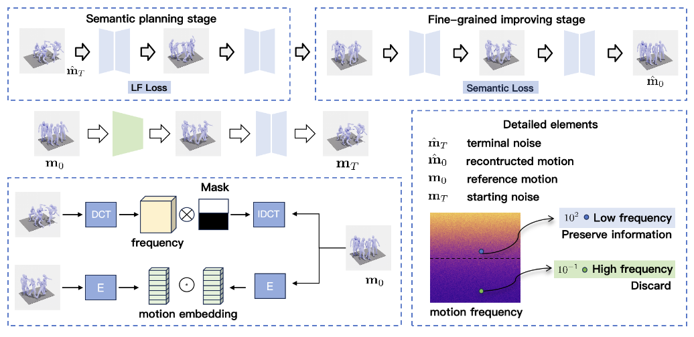

---

## Key Features 🛠️

- **Frequency-Domain Analysis**: Utilizes low-frequency components for enhanced semantic alignment, ensuring smoother and more natural motions. 📊
- **Consistency Losses**: Combines **low-frequency consistency** and **semantic consistency** losses to minimize artifacts and improve realism. ⚖️
- **State-of-the-Art Results**: Demonstrates superior performance on the **HumanML3D** and **KIT-ML** benchmarks. 🏆

---

## Why Choose Free-T2M? 🤔

Free-T2M integrates advanced frequency-domain techniques and robust consistency mechanisms, setting a new standard in text-to-motion generation. Its versatility spans applications in **animation**, **robotics**, and **virtual reality**, offering unmatched precision and quality. 🎯

---

## Performance Highlights 📈

- **FID Reduction**: Improved FID on the MDM baseline from **0.544** to **0.256**.
- **SOTA on StableMoFusion**: Achieved FID reduction from **0.189** to **0.051**.
- **Human Evaluations**: Significant improvements in user preference and subjective quality assessments.

## Evaluation Metrics for HumanML3D Dataset

The table below summarizes the evaluation metrics for the HumanML3D dataset. **Red** values indicate the best results, and **Blue** values indicate the second-best results. Metrics include **FID** (lower is better), **R-Precision** (higher is better), and **Diversity** (closer to real motion is better).

| **Method**                     | **Venue**       | **FID ↓**         |  **Top1**      |     **Top2** |  **Top3**         |
|--------------------------------|-----------------|-------------------|---------------------------------------------------|
| **Real**                       | -               | 0.002 ± 0.000     | 0.511 ± 0.003 | 0.703 ± 0.003 | 0.797 ± 0.002     |
| **MLD**                        | CVPR 2023       | 0.473 ± 0.013     | 0.481 ± 0.003 | 0.673 ± 0.003 | 0.772 ± 0.002     |
| **ReMoDiffuse**                | ICCV 2023       | 0.103 ± 0.004     | 0.510 ± 0.005 | 0.698 ± 0.006 | 0.795 ± 0.004     |
| **MotionDiffuse**              | TPAMI 2024      | 0.630 ± 0.001     | 0.491 ± 0.001 | 0.681 ± 0.001 | 0.782 ± 0.001     |
| **MotionLCM**                  | ECCV 2024       | 0.467 ± 0.012     | 0.502 ± 0.003 | 0.701 ± 0.002 | 0.803 ± 0.002     |
| **T2M-GPT**                    | CVPR 2023       | 0.141 ± 0.005     | 0.492 ± 0.003 | 0.679 ± 0.002 | 0.775 ± 0.002     |
| **MDM50steps**      | ICLR 2023       | 0.544 ± 0.044     | 0.320 ± 0.005 | 0.498 ± 0.004 | 0.611 ± 0.007     |
| **MDM1000steps**    | ICLR 2023       | 0.548 ± 0.085     | 0.313 ± 0.006 | 0.472 ± 0.007 | 0.601 ± 0.005     |
| **StableMoFusion**             | ACM MM 2024     | 0.189 ± 0.003     | 0.499 ± 0.004 | 0.680 ± 0.006 | 0.779 ± 0.007     |
| **Free-MDM50steps** | -               | 0.256 ± 0.045     | 0.466 ± 0.008 | 0.657 ± 0.007 | 0.757 ± 0.005     |
| **Free-MDM1000steps** | -             | 0.370 ± 0.030     | 0.435 ± 0.005 | 0.621 ± 0.007 | 0.722 ± 0.009     |
| **Free-StableMoFusion**        | -               | **0.051 ± 0.002** | **0.520 ± 0.013** | **0.707 ± 0.003** | **0.803 ± 0.006** |

### Notes:
- **FID ↓**: Lower values indicate better performance.
- **R-Precision ↑**: Higher values (top1, top2, top3) indicate better alignment between text prompts and generated motion.
- **Diversity →**: Higher values indicate the generated motions are closer to the diversity of real human motion.

This table highlights the **SOTA performance** of Free-T2M, particularly with **Free-StableMoFusion**, across all metrics.

---

## Denoising Process 🎥

Free-T2M refines motion generation through a staged denoising process. The table below illustrates the transition from noise to high-quality motion at different denoising steps:

  <table>
    <tr>
      <th>Step 50 (Noise)</th>
      <th>Step 40</th>
      <th>Step 30</th>
      <th>Step 20</th>
      <th>Step 10</th>
      <th>Step 0</th>
    </tr>
    <tr>
      <td>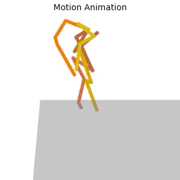</td>
      <td>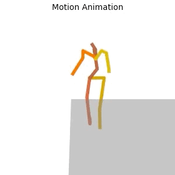</td>
      <td>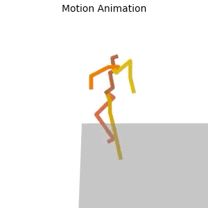</td>
      <td>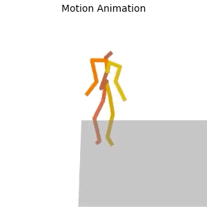</td>
      <td>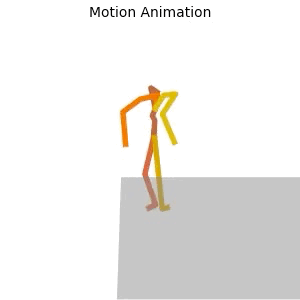</td>
      <td>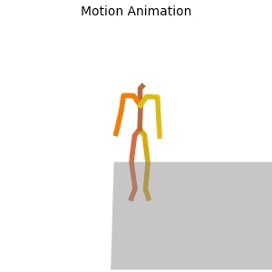</td>
    </tr>
  </table>

---

This horizontal layout with a scrollable table makes it easier to view the progression while maintaining a compact design.

## Visual Comparisons 🎬

### MDM Baseline vs. Free-T2M

The following table compares Free-T2M with the MDM baseline. Free-T2M produces more realistic and semantically aligned motions:

  <table>
    <tr>
      <th><b>Ours</b></th>
      <th><b>Baseline</b></th>
    </tr>
    <tr>
      <td>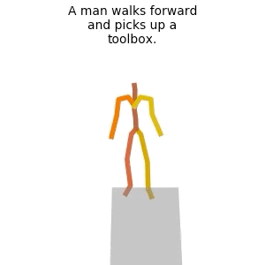</td>
      <td>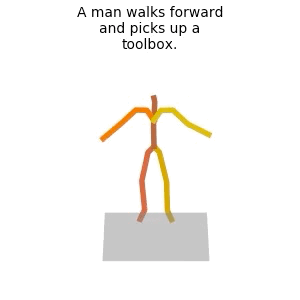</td>
    </tr>
    <tr>
      <td>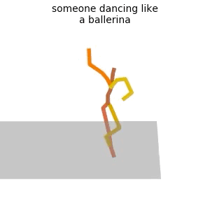</td>
      <td>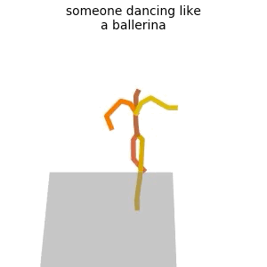</td>
    </tr>
    <tr>
      <td>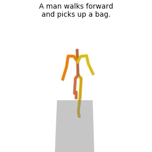</td>
      <td>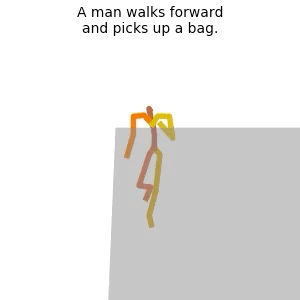</td>
    </tr>
  </table>

---

### StableMoFusion Baseline vs. Free-T2M

The table below highlights the superior performance of Free-T2M over the StableMoFusion baseline, showcasing more realistic and semantically aligned motions:

  <table>
    <tr>
      <th><b>Ours</b></th>
      <th><b>Baseline</b></th>
    </tr>
    <tr>
      <td>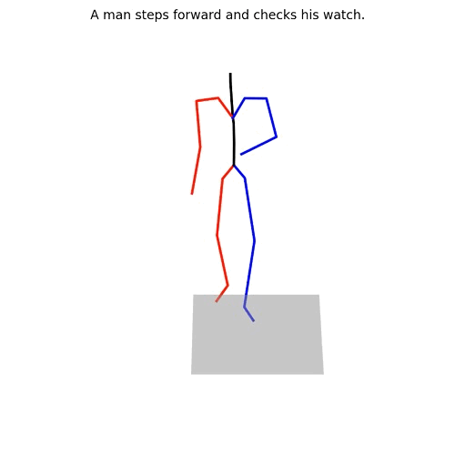</td>
      <td>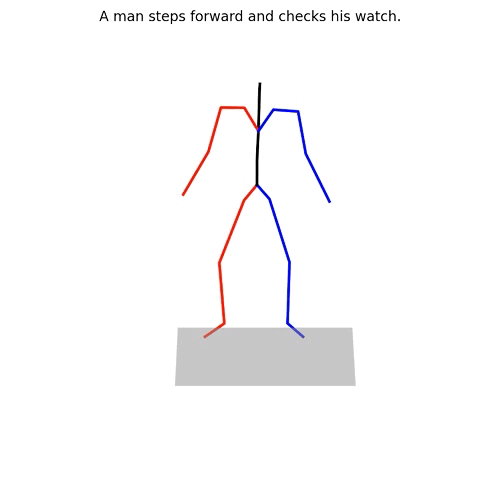</td>
    </tr>
    <tr>
      <td>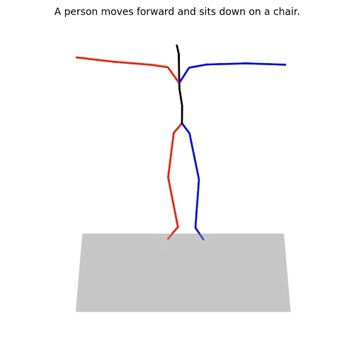</td>
      <td>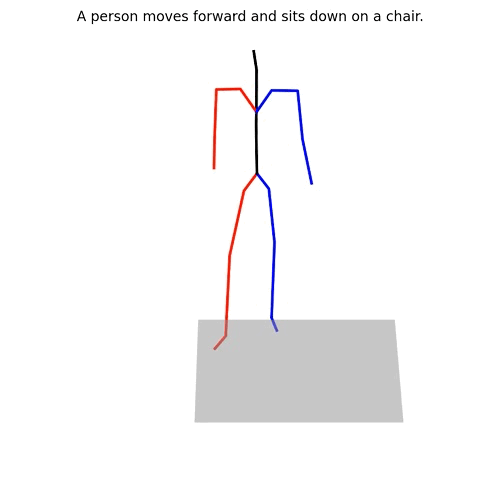</td>
    </tr>
    <tr>
      <td>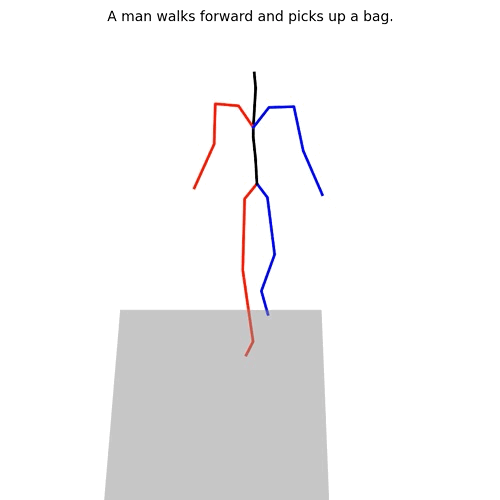</td>
      <td>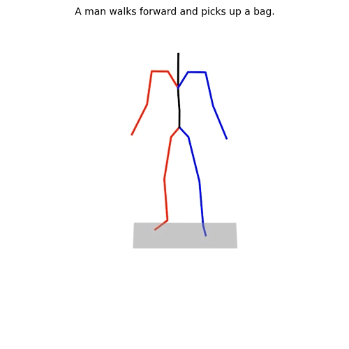</td>
    </tr>
  </table>

## Getting Started 🚀

### Using Free-T2M with **MDM**:

1. **Set Up the MDM Environment**:  
   Follow the [official MDM repository](https://github.com/GuyTevet/motion-diffusion-model) to configure the environment. Ensure all dependencies are installed.

2. **Integrate Free-T2M**:  
   Replace files in the MDM directory with those provided in this repository. This adds Free-T2M’s frequency-enhanced components.

3. **Train and Test**:  
   Use the original MDM training/testing pipelines. Free-T2M enhances robustness and precision during motion generation.

---

### Using Free-T2M with **StableMoFusion**:

1. **Set Up the StableMoFusion Environment**:  
   Refer to the [StableMoFusion repository](https://github.com/h-y1heng/StableMoFusion) for setup instructions.

2. **Integrate Free-T2M**:  
   Replace specific components in the StableMoFusion directory with files from this repository to enable Free-T2M’s enhancements.

3. **Train and Test**:  
   Use the StableMoFusion training/testing protocols. Free-T2M improves semantic alignment and motion quality.

---

## Contribute and Explore 🌟

Feel free to explore the repository and contribute to shaping the future of motion generation. Together, let’s redefine possibilities in text-to-motion generation! 🚀✨
