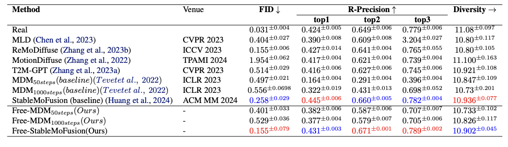

# Free-T2M: Frequency-Enhanced Text-to-Motion Diffusion Model 🚀

Free-T2M is a cutting-edge diffusion-based framework designed for **text-to-motion generation**. By leveraging **frequency-domain analysis** and **stage-specific consistency losses**, Free-T2M significantly enhances the robustness and precision of motion generation. The model introduces innovative **low-frequency consistency guidance** and **semantic consistency mechanisms**, achieving **state-of-the-art (SOTA)** performance across various benchmarks. 🌟

## Key Features 🛠️

- **Frequency-Domain Analysis**: Incorporates low-frequency components to improve semantic alignment during the denoising process, ensuring smoother and more natural motion generation. 📊
- **Consistency Losses**: Combines **low-frequency consistency** and **semantic consistency** losses to ensure stable and accurate motion generation, reducing artifacts and enhancing realism. ⚖️
- **State-of-the-Art Performance**: Demonstrates significant improvements in motion quality, achieving **SOTA results** on the **HumanML3D** and **KIT-ML** benchmarks. 🏆

## Why Free-T2M? 🤔

Free-T2M stands out by integrating advanced frequency-domain techniques with robust consistency mechanisms, making it a powerful tool for generating high-quality, semantically aligned motions from text descriptions. Whether for animation, robotics, or virtual reality, Free-T2M sets a new standard in text-to-motion generation. 🎯

## Performance Highlights 📈

- **FID Reduction**: Achieves a significant reduction in FID on the MDM baseline, improving from **0.544** to **0.256**.
- **SOTA on StableMoFusion**: Reduces FID from **0.189** to **0.051**, establishing a new benchmark within the diffusion architecture.
- **Human Subjective Evaluations**: Demonstrates substantial improvements in human subjective evaluations, further validating its superiority.

## Denoising Process Demonstration 🎥

The following videos demonstrate the **denoising process** in text-to-motion generation, showcasing the transformation from random noise to high-quality motion results:

  
  
  
  
  
  

These videos vividly illustrate how the model incrementally refines motion generation, from random noise (step 0) to complete motion (step 50), highlighting the exceptional performance of **low-frequency consistency guidance** and **semantic consistency mechanisms**. ✨

## Visual Comparison: MDM Ours vs. Baseline 🎬

The following GIFs demonstrate a direct comparison between the **Free-T2M model** and the **MDM baseline**, highlighting the superior performance of Free-T2M in generating more realistic and semantically aligned motions:

  

    
<b>Ours</b>

    
    
    
  

  

    
<b>Baseline</b>

    
    
    
  

This comparison clearly demonstrates how Free-T2M produces more semantically aligned and visually appealing motion sequences compared to the MDM baseline. 🌟

---

## Visual Comparison: StableMoFusion Ours vs. Baseline ✨

The following GIFs demonstrate a direct comparison between the **Free-T2M model** and the **StableMoFusion baseline**, showcasing the superior performance of Free-T2M in generating more realistic and semantically aligned motions:

  

    
<b>Ours</b>

    
    
    
  

  

    
<b>Baseline</b>

    
    
    
  

This comparison clearly demonstrates how Free-T2M produces more semantically aligned and visually appealing motion sequences compared to the StableMoFusion baseline. 🚀

## Getting Started 🚀

To begin using Free-T2M with the MDM (Motion Diffusion Model) framework, follow these steps:

1. **Set Up the MDM Environment**:  
   First, configure the MDM environment as outlined in the official [MDM repository](https://github.com/GuyTevet/motion-diffusion-model). Ensure all dependencies and requirements are properly installed.

2. **Integrate Free-T2M**:  
   Replace the corresponding parts in the MDM folder with the files provided in the `MDM` directory of this repository. This step ensures that the frequency-enhanced components and consistency mechanisms of Free-T2M are seamlessly integrated into the MDM framework.

3. **Train and Test**:  
   Once the setup is complete, you can proceed with training and testing as described in the original MDM documentation. Free-T2M enhances the baseline MDM model, enabling more robust and precise text-to-motion generation.

For detailed instructions, refer to the [MDM repository](https://github.com/GuyTevet/motion-diffusion-model) and the documentation provided in this repository. Happy experimenting! 🚀✨

Feel free to explore the repository and contribute to the future of motion generation! 🚀✨
